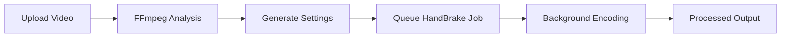

# Video Optimization Studio 🎬

[](https://docker.com)
[](https://fastapi.tiangolo.com)
[](https://reactjs.org)
[](https://mongodb.com)

A comprehensive Docker-based video optimization platform that automatically analyzes video files and generates optimal HandBrake settings for maximum compression while maintaining quality.

## ✨ Features

🎥 **Video Analysis**: Automatic FFmpeg-powered analysis of resolution, bitrate, codecs, duration, and metadata  
🔧 **HandBrake Integration**: Direct integration with HandBrake CLI for automated encoding  
🧠 **Smart Optimization**: Intelligent settings generation based on content type and quality requirements  
📁 **Directory Monitoring**: Automatic detection and processing of video files  
🌐 **Web Interface**: Modern React-based UI with drag-drop upload and progress tracking  
🐳 **Docker Ready**: Complete containerized deployment with production optimizations  
📊 **Real-time Monitoring**: Health checks, resource monitoring, and automated maintenance  
🔒 **Security Hardened**: Non-root containers, security headers, and rate limiting  

## 🚀 Quick Start

### One-Command Setup
```bash
git clone <repository-url> video-optimizer
cd video-optimizer
./setup.sh
```

### Manual Setup
```bash
# 1. Setup environment
make setup

# 2. Start services  
make up

# 3. Open application
open http://localhost:3000
```

## 📋 Prerequisites

- **Docker**: 20.10+ 
- **Docker Compose**: 2.0+
- **System Resources**: 4GB RAM, 10GB disk space
- **Ports**: 3000, 8001, 27017 available

## 🏗️ Architecture

```
┌─────────────────┐    ┌─────────────────┐    ┌─────────────────┐
│   React Web     │    │   FastAPI       │    │   MongoDB       │
│   Frontend      │◄──►│   Backend       │◄──►│   Database      │
│   (Port 3000)   │    │   (Port 8001)   │    │   (Port 27017)  │
└─────────────────┘    └─────────────────┘    └─────────────────┘
         │                        │                        │
         │              ┌─────────────────┐                │
         └──────────────►│     Nginx       │◄───────────────┘
                        │  Reverse Proxy  │
                        │   (Port 80)     │
                        └─────────────────┘
                                 │
                        ┌─────────────────┐
                        │    HandBrake    │
                        │   FFmpeg Tools  │
                        └─────────────────┘
```

## 📦 Services

| Service | Port | Description | Health Check |
|---------|------|-------------|--------------|
| **Frontend** | 3000 | React web interface | `http://localhost:3000/` |
| **Backend** | 8001 | FastAPI REST API | `http://localhost:8001/api/` |
| **Database** | 27017 | MongoDB storage | Internal |
| **Nginx** | 80 | Reverse proxy (prod) | `http://localhost/health` |

## 🎯 Usage

### Upload Videos
1. **Web Interface**: Drag & drop at http://localhost:3000
2. **Directory**: Place files in `./videos/` folder
3. **API**: Direct upload via REST API

### Video Processing Workflow


### Supported Formats
- **Input**: MP4, AVI, MKV, MOV, WebM, FLV, WMV, M4V, MPG, MPEG, TS, MTS
- **Output**: MP4, MKV with optimized codecs (H.264, H.265)
- **File Size**: Unlimited (tested with 10GB+ files)

## 🛠️ Management Commands

```bash
# Quick Commands
make up          # Start development
make prod        # Start production
make down        # Stop services
make logs        # View logs
make health      # Health check
make clean       # Full cleanup

# Advanced Management
./deploy.sh -e production -b -m    # Production deployment with backup
./monitor.sh monitor               # System monitoring
./validate-docker.sh              # Configuration validation
```

## 📊 Monitoring & Maintenance

### Health Monitoring
```bash
# System status
make status

# Resource monitoring  
./monitor.sh monitor

# Generate health report
./monitor.sh report
```

### Automated Maintenance
```bash
# Database backup
./monitor.sh backup

# Log cleanup
./monitor.sh cleanup

# System updates
./monitor.sh update
```

## 🔧 Configuration

### Environment Variables
```bash
# Core Settings
BACKEND_PORT=8001
FRONTEND_PORT=3000
MONGO_PORT=27017

# Security
MONGO_ROOT_PASSWORD=secure-password
MONGO_USER_PASSWORD=user-password

# Storage
VIDEO_INPUT_DIR=./videos
VIDEO_OUTPUT_DIR=./output
```

### Optimization Settings
The system automatically selects optimal HandBrake settings based on:

| Resolution | Preset | Encoder | CRF | Strategy |
|------------|--------|---------|-----|----------|
| **4K** (2160p+) | Very Slow | x265 | 20 | Maximum compression |
| **1080p** | Slow | x264 | 22 | Balanced quality |
| **720p** | Medium | x264 | 23 | Fast encoding |
| **SD** (<720p) | Fast | x264 | 25 | Quick processing |

## 🏭 Production Deployment

### Production Mode
```bash
# Deploy with optimizations
./deploy.sh --environment production --backup --migrate

# Enable monitoring
docker-compose --profile production up -d
```

### Security Checklist
- [ ] Change default passwords in `.env`
- [ ] Configure SSL/TLS certificates  
- [ ] Set up firewall rules
- [ ] Enable log monitoring
- [ ] Schedule automated backups
- [ ] Configure rate limiting

### Performance Tuning
```bash
# Increase worker processes
export WORKERS=8

# Optimize MongoDB cache
export MONGO_CACHE_SIZE=2G

# Configure nginx worker processes
export NGINX_WORKERS=auto
```

## 🔒 Security Features

- **Container Security**: Non-root users, read-only filesystems
- **Network Isolation**: Custom Docker networks with restricted access
- **Input Validation**: File type validation, size limits, sanitization
- **Rate Limiting**: API throttling and upload restrictions
- **Security Headers**: XSS protection, content type validation
- **Access Control**: Environment-based configuration

## 📚 Documentation

- **[Quick Start Guide](QUICKSTART.md)**: 5-minute setup
- **[Docker Guide](DOCKER_README.md)**: Complete Docker reference
- **[API Documentation](http://localhost:8001/docs)**: Interactive API docs
- **[Troubleshooting](#troubleshooting)**: Common issues and solutions

## 🧪 Testing

### Automated Validation
```bash
# Validate configuration
./validate-docker.sh

# Full system test
./test-docker.sh

# Backend API tests
make test
```

### Manual Testing
```bash
# Test video upload
curl -F "file=@test.mp4" http://localhost:8001/api/test-upload

# Check system health  
curl http://localhost:8001/api/system-info

# Monitor processing
curl http://localhost:8001/api/jobs
```

## 🔧 Troubleshooting

### Common Issues

**Services won't start:**
```bash
# Check Docker daemon
sudo systemctl status docker

# Free resources
docker system prune -f

# Rebuild images
make build
```

**Upload failures:**
```bash
# Check upload limits
make logs frontend

# Verify backend
make logs backend

# Test endpoint
curl -F "file=@test.mp4" http://localhost:8001/api/test-upload
```

**Database issues:**
```bash
# Check MongoDB
make db-shell

# Reset database (⚠️ deletes data)
docker-compose down -v && make up
```

### Log Analysis
```bash
# View all logs
make logs-f

# Service-specific logs
docker-compose logs backend
docker-compose logs frontend
docker-compose logs mongodb

# Save logs for debugging
docker-compose logs > debug.log
```

## 🤝 Contributing

1. Fork the repository
2. Create feature branch: `git checkout -b feature/amazing-feature`
3. Commit changes: `git commit -m 'Add amazing feature'`
4. Push to branch: `git push origin feature/amazing-feature`
5. Open Pull Request

## 📜 License

This project is licensed under the MIT License - see the [LICENSE](LICENSE) file for details.

## 🙏 Acknowledgments

- **HandBrake**: Video transcoding engine
- **FFmpeg**: Video analysis and processing
- **FastAPI**: Modern Python web framework
- **React**: User interface library
- **MongoDB**: Document database
- **Docker**: Containerization platform

---

<div align="center">
  <strong>Built with ❤️ for video optimization enthusiasts</strong>
  <br>
  <sub>Star ⭐ this repository if it helped you!</sub>
</div>